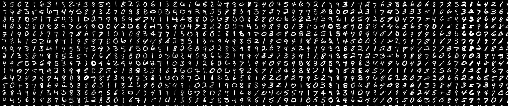

# Digit-Recognizer
> Implementing computer vision fundamentals with the famous MNIST data

MNIST ("Modified National Institute of Standards and Technology") is the de facto “hello world” dataset of computer vision. Since its release in 1999, this classic dataset of handwritten images has served as the basis for benchmarking classification algorithms. As new machine learning techniques emerge, MNIST remains a reliable resource for researchers and learners alike.
From a collection of tens of thousands of handwritten photos, I will attempt to accurately identify digits in this Project.

The Programming Language used in this project is <ins>***Python***</ins> and the environment is <ins>**Google Colab**</ins>  

### Contents:
<!---  //   
 * Language 
 * Practice Skills
 * Data Description
-->

